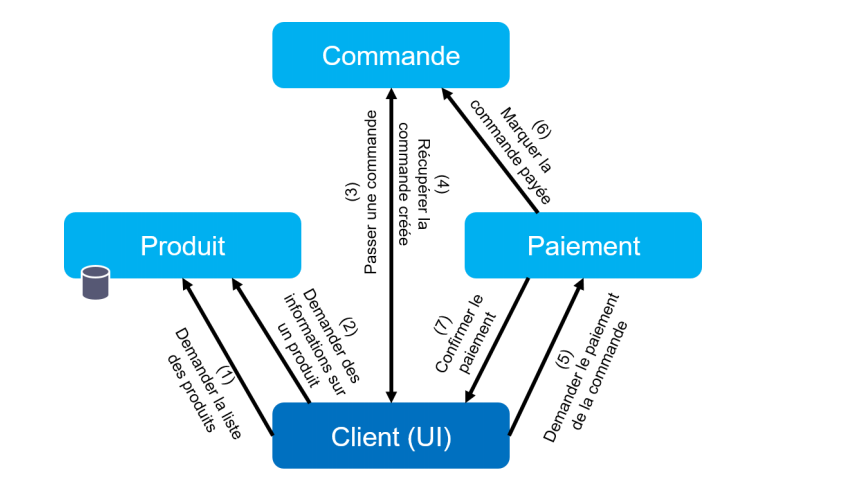
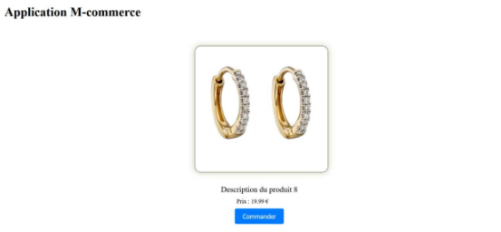
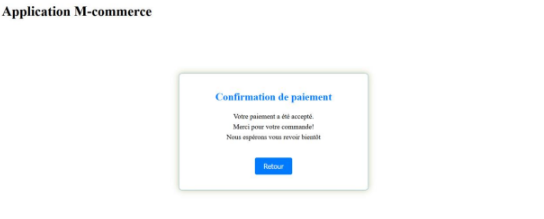

# Mcommerce Microservices Application

## Overview

Welcome to the Mcommerce project! This repository is dedicated to the development of a microservices-based application named Mcommerce. We follow cloud-native best practices and utilize technologies such as containerization, container orchestration, and more.

## Features

- Microservices architecture.
- Containerization of services.
- Container orchestration.
- Automated build process.
- Security scanning.
- Docker image packaging.
- Docker image publishing.
- GitLab CI integration.

## Architecture of the application :

## The app is Running:

